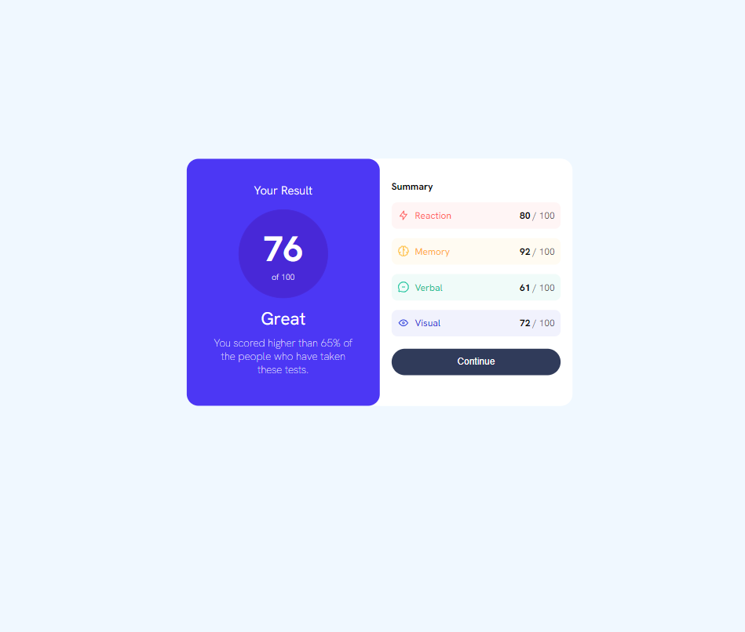

# Frontend Mentor - Results summary component solution

This is a solution to the [Results summary component challenge on Frontend Mentor](https://www.frontendmentor.io/challenges/results-summary-component-CE_K6s0maV). Frontend Mentor challenges help you improve your coding skills by building realistic projects.

## Table of contents

- [Overview](#overview)
  - [The challenge](#the-challenge)
  - [Screenshot](#screenshot)
  - [Links](#links)
- [My process](#my-process)
  - [Built with](#built-with)
  - [What I learned](#what-i-learned)
  - [Continued development](#continued-development)
- [Author](#author)

## Overview

A simple results summary component using HTML and CSS.

### The challenge

Users should be able to:

- View the optimal layout for the interface depending on their device's screen size
- See hover and focus states for all interactive elements on the page
- **Bonus**: Use the local JSON data to dynamically populate the content

### Screenshot

### Links

- Solution URL: [GitHub](https://github.com/kayan2004/results-summary-component)
- Live Site URL: [Vercel](https://your-live-site-url.com)

## My process

### Built with

- Semantic HTML5 markup
- CSS custom properties
- Flexbox
- Mobile-first workflow

### What I learned

I mostly learned how to adapt styling on different screen sizes. I used to struggle with that alot and I still do, but this exercice opened my mind on a new way to approach this problem.

### Continued development

Later I will do the bonus challenge for this project and I'll keep practicing building interactive website

**Note: Delete this note and the content within this section and replace with your own plans for continued development.**

## Author

- Website - [Kayan](https://www.your-site.com)
- Frontend Mentor - [@kayan2004](https://www.frontendmentor.io/profile/kayan2004)
- Github - [@kayan2004](https://github.com/kayan2004)
